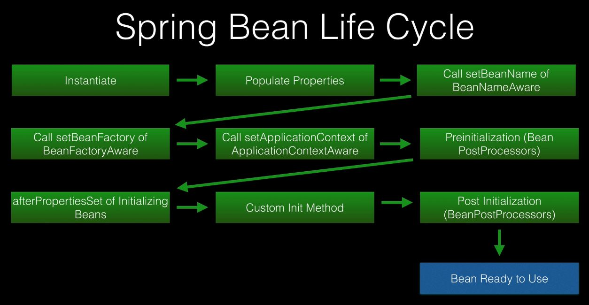
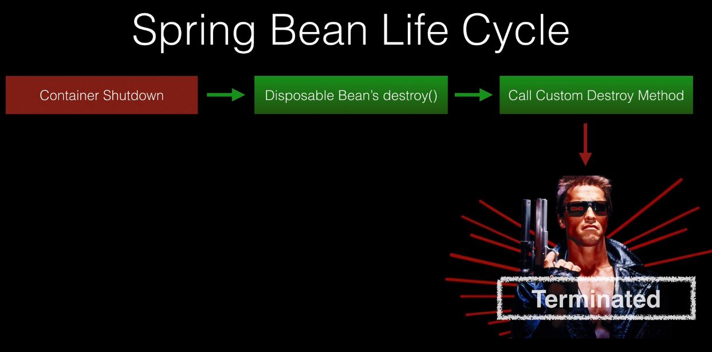
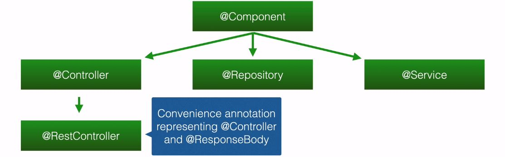

Spring keeps the beans it has created inside of its application context.

When it creates a bean, then by default it's the name of the class turned into
lower camelcase.

`@Autowired` isn't needed anymore when doing constructor injection.

`@Qualifier` says which bean to use by name. Used when you have multiple beans
of the same type.

`@Primary` is used to specify the main bean of a type to use. Used when there's
a default bean you want to inject when there are many of the same type.

`@Profile` can be used to define beans based on the currently active profile. Profile
has the `default` keyword that can be specified on the bean, which means that
the bean will be created when there's no profile specified.
`spring.profiles.active` is used to define what the active profile is.

Spring beans go through different stages in the lifecycle. You can implement
specific Spring callback interfaces to run code at certain stages.

Alternatively, you can use annotations to access certain stages. Namely 
`@PostConstruct` to trigger a method after a bean has been constructed, but before
it's returned to the requesting object.
`@PreDestroy` is called before the bean is destroyed by the container.

To access more specific lifecycle methods, then you can implement `BeanPostProcessor`
which has a couple of methods. `postProcessBeforeInitialization` - called before the
bean initialization method. `postProcessAfterInitialization` - called after bean
initialization.

Spring has a number of `Aware` interfaces that are used for framework internal
communication. Mostly not used by the developers using Spring. Only for niche
use cases. Some examples:

Spring stereotypes are class level annotations used to define Spring Beans.
When classes annotated with it are detected via the component scan, an
instance of the class will be added to the Spring context. These are - 
@Component, @Controller, @RestController, @Repository, @Service.

In some cases you can omit the annotation and they are still picked up, because
the extended interface already has it. E.g. @Repository.

Spring Boot's auto configuration will tell Spring to perform a component scan of the
package of the main class, which includes all of the sub packages. If a class
is outside of the main class package tree, then you must declare the packages
to scan. If you declare @ComponentScan, then you have to specify the default
package in it as well, otherwise the default behavior simply gets overwritten.