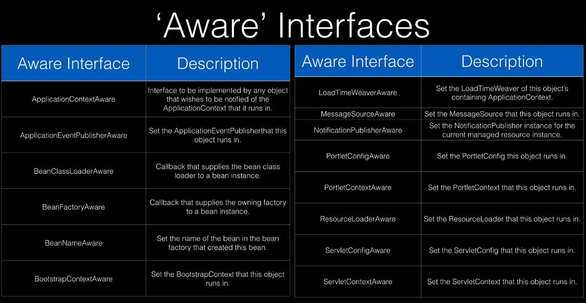

Spring keeps the beans it has created inside of its application context.

When it creates a bean, then by default it's the name of the class turned into
lower camelcase.

`@Autowired` isn't needed anymore when doing constructor injection.

`@Qualifier` says which bean to use by name. Used when you have multiple beans
of the same type.

`@Primary` is used to specify the main bean of a type to use. Used when there's
a default bean you want to inject when there are many of the same type.

`@Profile` can be used to define beans based on the currently active profile. Profile
has the `default` keyword that can be specified on the bean, which means that
the bean will be created when there's no profile specified.
`spring.profiles.active` is used to define what the active profile is.

Spring beans go through different stages in the lifecycle. You can implement
specific Spring callback interfaces to run code at certain stages.

Alternatively, you can use annotations to access certain stages. Namely 
`@PostConstruct` to trigger a method after a bean has been constructed, but before
it's returned to the requesting object.
`@PreDestroy` is called before the bean is destroyed by the container.

To access more specific lifecycle methods, then you can implement `BeanPostProcessor`
which has a couple of methods. `postProcessBeforeInitialization` - called before the
bean initialization method. `postProcessAfterInitialization` - called after bean
initialization.

Spring has a number of `Aware` interfaces that are used for framework internal
communication. Mostly not used by the developers using Spring. Only for niche
use cases. Some examples:

Spring stereotypes are class level annotations used to define Spring Beans.
When classes annotated with it are detected via the component scan, an
instance of the class will be added to the Spring context. These are - 
@Component, @Controller, @RestController, @Repository, @Service.

In some cases you can omit the annotation and they are still picked up, because
the extended interface already has it. E.g. @Repository.

Spring Boot's auto configuration will tell Spring to perform a component scan of the
package of the main class, which includes all of the sub packages. If a class
is outside of the main class package tree, then you must declare the packages
to scan. If you declare @ComponentScan, then you have to specify the default
package in it as well, otherwise the default behavior simply gets overwritten.

@Configuration classes are used usually when you are using a third party library,
code that you don't own. 

If you're using Spring Boot, then `@PropertySource` is not needed for property
injection, as Spring will look from the property inside of `application.properties`
by default.

Data fetch types: 

Lazy - not queried until references
Eager - queried up front

JPA 2.1 fetch type defaults:

OneToMany - Lazy
ManyToOne - Eager
ManyToMany - Lazy
OneToOne - Eager

JPA cascade types:

Control how state changes are cascaded from parent objects to child objects.

JPA cascade types:

* PERSIST - save operations will cascade to related entities
* MERGE - related entities are merged when the owning entity is merged
* REFRESH - related entities are refreshed when the owning entity is refreshed
* REMOVE - removes all related entities when the owning entity is deleted
* DETACH - detaches all related entities if a manual detach occurs
* ALL - applies all the above cascade options

By default, no operations are cascaded

Embeddable types are supported by JPA. These are used to define a common
set of properties. E.g. billing address and shipping address will have the same 
fields.

Inheritance is supported by JPA.
* MappedSuperclass - entities inherit from a super class. A database table
IS NOT created for the super class.
* Single table (Hibernate default) - one table is used for all subclasses
* Joined table - base class and subclasses have their own tables. Fetching
subclass entities require a join to the parent table.
* Table per class - each subclass has its own table.

Create and update timestamps
* Often a best practice to use create and update timestamps on your entities
for audit purposes
* JPA supports @PrePersist and @PreUpdate which can be used to support audit
timestamps via JPA lifecycle callbacks
* Hibernate specific API provides @CreationTimestamp and @UpdateTimestamp

Hibernate DDL auto
* DDL = Data Definition Language - type of SQL used to declare tables, indexes etc.
* DML = Data Manipulation Language - type of SQL used to manipulate the data,
so INSERT, UPDATE etc.
* `spring.jpa.hibernate.ddl-auto` is a property specific to Hibernate. It
allows your database tables to be created from your describe entity classes.
The options are `none`, `validate`, `update`, `create`, `create-drop`. `None` means that
nothing is created. `Validate` makes it so the app checks, on startup, if all
of the describe columns are present on not. Good choice in production to avoid
being surprised by a missing column during runtime. Spring Boot will use
`create-drop` for embedded databases (hsql, h2, derby) or none. `create-drop` 
means that on boot the tables will get created and on shutdown they'll get
removed.
* Initial data can be loaded into the database using `import.sql`. Default
name that Spring Boot will look for if Hibernate is added. It is only executed
if Hibernate's ddl-auto property is set to `create` or `create-drop`.
* Spring JDBC initializer, however, uses `schema.sql` and `data.sql`.
Can also define platform specific SQL, so `schema-${platform}.sql` and 
`schema-${platform}.sql`. In order to use platform specific SQL-s, then
you have to manually provide the property `spring.datasource.platform`.
It may conflict with Hibernate's DDL auto, so use `none` or `validate`
for that. As JDBC is the more generic approach, then rely on that behavior,
if you needed this kind of feature.